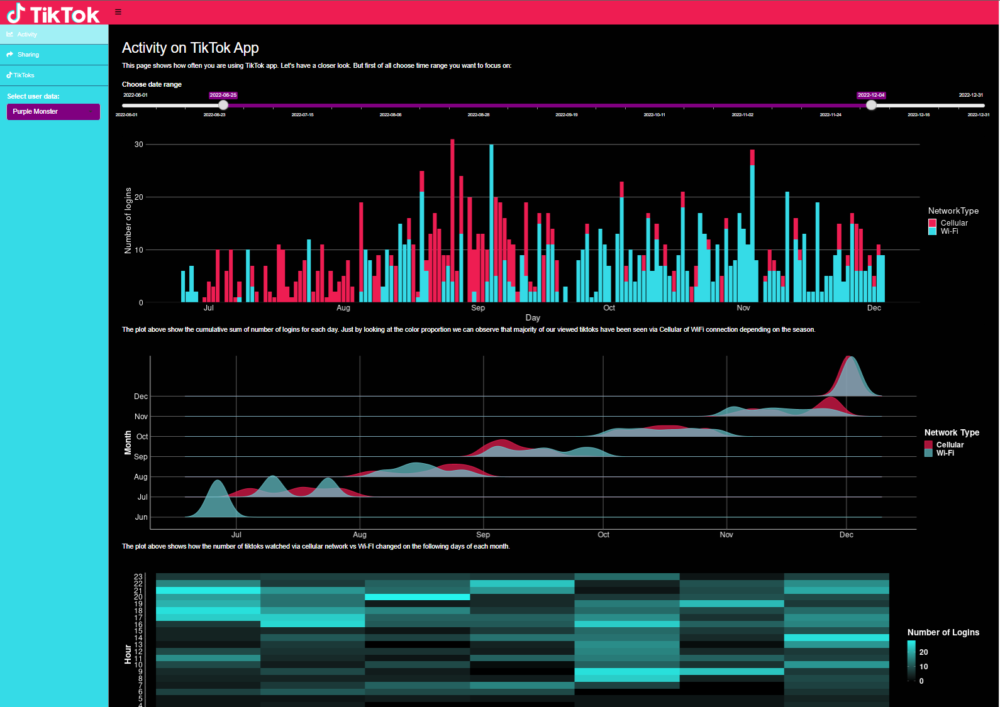
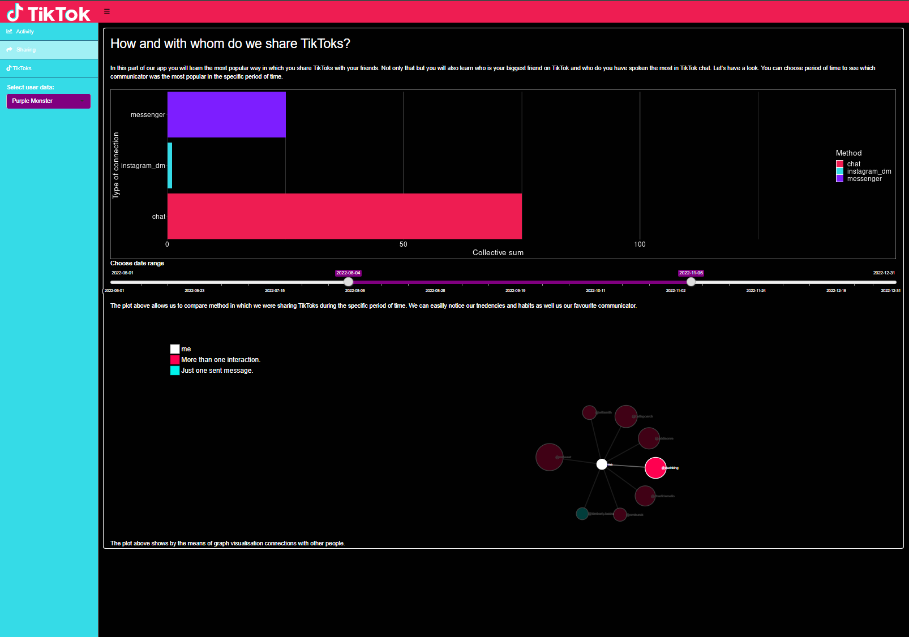
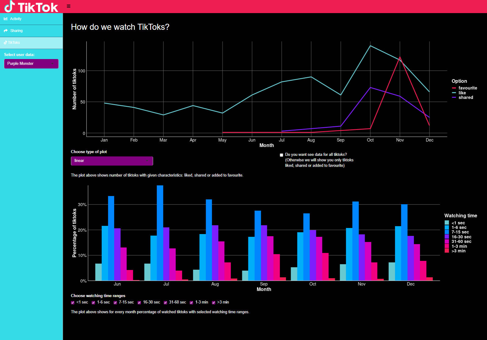

# TikTok Analysis

## About the project

This project was created as a submission for course Technics of Data Visualisation. It represents data obtained from several users from a social media app - TikTok. The whole project was created using R language and all of the visualisations are interactive and were created in a Shiny app.

## Main functionality

Users are free to choose which user's data they want to show statistics for. All types of activities which can be done on TikTok are stored in corresponding separate categories. 

 #### Activity - tab
 This tab is devoted to overall activity e.g. how many times we log into the app, what type of connection do we use (Wifi/Cellular)

#### Sharing - tab

 This tab is devoted to show ways in which we share watched videos e.g. messages, discord, instagram_dm, messenger. It also presents with whom we have the most interactions in the TikTok app.
 

#### TikToks - tab

 This tab is devoted to TikToks we watch in general. We can choose another alluvial plot to show correlation between liked, shared, and added to favourite videos. We can also compare proportions of each category of reaction to videos. There is also comparison of watchtime to show how long do we usually watch one tiktok
 

> By Zuzanna Piróg & Marta Szuwarska & Adrian Zaręba
